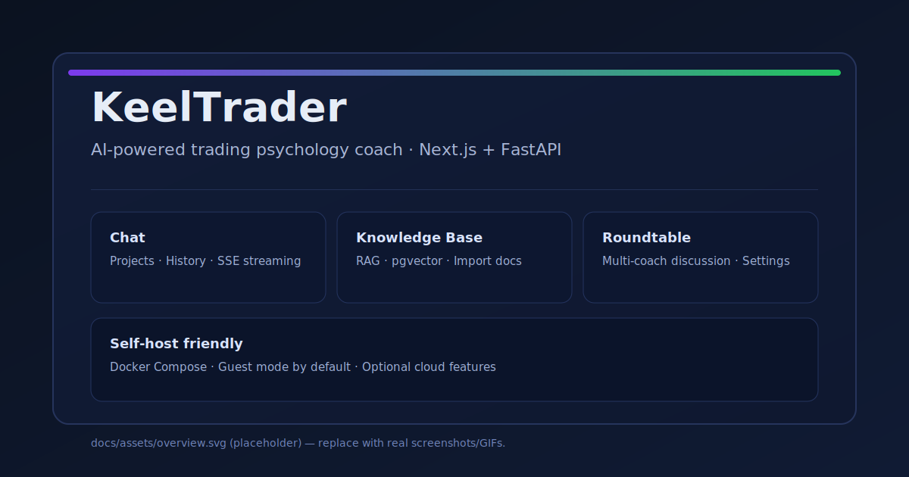

# AIWendy

[English](README.md) | [简体中文](README.zh-CN.md)

<a id="zh-cn"></a>
[简体中文](#zh-cn) | [English](#en)

[](https://github.com/fretelli/AIWendy/actions/workflows/ci.yml)
[](LICENSE)

AIWendy 是一套面向交易心理与行为表现的 AI 教练系统（Web: Next.js，API: FastAPI）。核心能力围绕：对话、知识库（RAG）、以及"圆桌讨论"（多教练协作）。

免责声明：仅用于教育/研究目的，本项目 **不构成** 投资建议。

## 产品灵感：谁是 Wendy Rhodes?

在美剧《Billions》中，**Wendy Rhodes** 是对冲基金 Axe Capital 的驻场心理绩效教练（Performance Coach）。她的职责不是做投资分析，而是：

| 她做什么 | 具体场景 |
|----------|----------|
| **情绪急救** | 交易员在盘中崩溃时，她会立即介入，帮助他们冷静下来继续工作 |
| **行为模式识别** | 发现某个交易员最近连续亏损是因为离婚影响了判断 |
| **认知重构** | 帮助过度自信的明星交易员意识到自己的盲点 |
| **心理韧性训练** | 让交易员学会在巨额亏损后快速恢复状态 |
| **绩效提升** | 通过心理辅导让整个团队的交易表现更稳定 |

**现实中的问题**：
- 顶级对冲基金才养得起全职心理绩效教练（年薪 $300K+）
- 散户和小型机构根本接触不到这种服务
- 大多数交易者的亏损 80% 来自心理因素，而非技术分析

**AIWendy 的愿景**：
> 用 AI 把 Wendy Rhodes 的能力民主化，让每个交易者都能有自己的心理绩效教练。

## 行为金融 3.0 定位

AIWendy 代表了行为金融学从理论到实践的演进：

| 代际 | 关注点 | 局限性 |
|------|--------|--------|
| **1.0 学术研究** | Kahneman & Tversky 的认知偏差理论 | 理论停留在教科书，交易者无法应用 |
| **2.0 智能投顾** | 自动化资产配置 | 千人一面，忽视个体心理差异 |
| **3.0 AI 绩效教练** | 实时心理干预 | 个性化、可执行、自适应 |

### AIWendy 的差异化优势

**传统方法**（行为金融 1.0 & 2.0）：
- 读过损失厌恶理论 → 暴跌时还是恐慌割肉
- 知道确认偏误 → 还是只看利好消息
- 理解过度自信 → 连赢后还是重仓梭哈

**AIWendy 的方法**（行为金融 3.0）：
- **实时干预**：从交易日志中检测情绪模式，在你犯错之前介入
- **个性化教练**：学习你的特定心理触发点和盲区
- **可执行指导**：不是告诉你"你有损失厌恶"，而是"面对这笔交易决策，你应该这样做"
- **持续学习**：根据对你真正有效的方法调整教练策略

### 我们填补的空白

```
学术知识 → [缺失环节] → 交易绩效
 (BF 1.0)                    (你的盈亏)
              ↓
          AIWendy
       (BF 3.0 桥梁)
```

大多数交易者懂理论但执行失败。AIWendy 通过以下方式弥合这一鸿沟：
1. **关键时刻教练**：在你准备报复性交易时介入，而不是事后诸葛亮
2. **模式识别**：在你意识到之前就发现你的重复性错误
3. **问责伙伴**：在情绪高涨时帮你坚持交易计划

## 截图 / 演示




## 你可以用它做什么

- **对话 + 项目**：按项目组织会话，历史记录，SSE 流式输出
- **圆桌讨论**：多位 AI 教练围绕同一问题讨论；支持会话级/消息级设置
- **知识库（RAG）**：文档导入、pgvector 语义检索，按时机注入上下文
- **附件**：图片/文档/音频上传（按能力抽取/转写）
- **交易日志 + 报告**：交易日志、统计、定时报表（Celery）
- **交易日志导入（CSV/XLSX）**：支持上传文件并在页面中手动映射列（适配不同券商/平台格式）
- **默认可自托管**：Docker Compose 一键启动；也支持通过环境变量启用云端模式

## 快速开始（自托管）

```bash
cd aiwendy
Copy-Item .env.example .env   # PowerShell（或：cp .env.example .env）
docker compose up -d --build
```

- Web：`http://localhost:3000`
- API 健康检查：`http://localhost:8000/api/health`
- API 文档：`http://localhost:8000/docs`

完整说明：`aiwendy/docs/SELF_HOSTING.md`

## 访客模式（免登录）

将 API 的 `AIWENDY_AUTH_REQUIRED=0`（默认在 `aiwendy/docker-compose.yml` 已启用该能力）即可免登录体验。

## Roadmap（社区版）

- 增加更多“一键 Demo”部署模板
- 预设教练库的导入/导出与共享
- 教练效果的评测与对比工具

## 文档

- 从这里开始：`aiwendy/docs/README.md`
- 架构：`aiwendy/docs/ARCHITECTURE.md`
- 部署：`aiwendy/docs/DEPLOYMENT.md`
- 自托管：`aiwendy/docs/SELF_HOSTING.md`
- 部署模式：`aiwendy/docs/DEPLOYMENT_MODES.md`
- 自定义 API：`aiwendy/docs/CUSTOM_API_SETUP.md`
- 国际化：`aiwendy/docs/I18N_GUIDE.md`

## 贡献与安全

- **分支策略**：我们使用 Git Flow。请从 `develop` 分支创建功能分支，并将 PR 提交到 `develop`（不是 `main`）。详见 `CONTRIBUTING.md`。
- 贡献指南：`CONTRIBUTING.md`
- 行为准则：`CODE_OF_CONDUCT.md`
- 安全策略：`SECURITY.md`

## 部署模式（Open Core）

AIWendy 支持两种模式：

- **Self-Hosted（默认）**：开源社区版
- **Cloud/SaaS**：多租户、计费、企业 SSO、分析（仅在 `DEPLOYMENT_MODE=cloud` 时启用）

详见：`docs/DEPLOYMENT_MODES.md`

---

<a id="en"></a>
## English

AIWendy is an AI-powered performance coach for trading psychology (Web: Next.js, API: FastAPI). It’s built around chat, knowledge base (RAG), and a “roundtable” multi-coach discussion mode.

Disclaimer: for educational/research purposes only. This project is **not** investment advice.

### Screenshots


### What you can do

- **Chat + projects**: organize conversations per project, keep history, stream responses (SSE)
- **Roundtable discussion**: multiple AI coaches discuss one question with configurable session/message settings
- **Knowledge base (RAG)**: import docs, semantic search (pgvector), inject context by timing
- **Attachments**: upload images/docs/audio (extract/transcribe where supported)
- **Journaling + reports**: trading journal, analytics, scheduled reports (Celery)
- **Journal import (CSV/XLSX)**: upload a file and map columns in the UI (works with different broker/export formats)
- **Self-hosted by default**: Docker Compose; optional cloud/SaaS mode via env flags

### Quick start (self-host)

```bash
cd aiwendy
Copy-Item .env.example .env   # PowerShell (or: cp .env.example .env)
docker compose up -d --build
```

- Web: `http://localhost:3000`
- API health: `http://localhost:8000/api/health`
- API docs: `http://localhost:8000/docs`

Full guide: `aiwendy/docs/SELF_HOSTING.md`

### Guest mode (no login)

Set `AIWENDY_AUTH_REQUIRED=0` for the API (enabled by default in `aiwendy/docker-compose.yml`) to use the app without logging in.

### Roadmap (community)

- Add more “1-click demo” options (cloud deploy templates)
- Improve preset library and import/export
- More evaluators/benchmarks for coaching quality

### Docs

- Start here: `docs/README.md`
- Repo map: `docs/PROJECT_OVERVIEW.md`
- App docs: `aiwendy/docs/README.md`
- Architecture: `aiwendy/docs/ARCHITECTURE.md`
- Deployment: `aiwendy/docs/DEPLOYMENT.md`

### Contributing & security

- Contributing: `CONTRIBUTING.md`
- Code of Conduct: `CODE_OF_CONDUCT.md`
- Security policy: `SECURITY.md`

### Deployment modes (open core)

AIWendy supports two modes:

- **Self-hosted (default)**: open-source community edition
- **Cloud/SaaS**: multi-tenancy, billing, enterprise SSO, analytics (activated only when `DEPLOYMENT_MODE=cloud`)

See `docs/DEPLOYMENT_MODES.md` for details.
